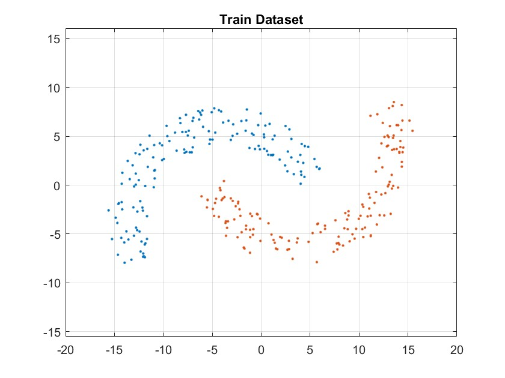

# Neural Networks and Learning Machines

## Double-Moon Structures
```matlab
radius = 10; width = 4; theta = 25; distance = -4;
N = 400; train2total = 0.75; drawPatterns = true;

[train, test] = doubleMoonStructure( radius, width, theta, distance, ...
                                     N, train2total, drawPatterns );
```



## Rosenblatt's Perceptron
### Train Perceptron
```matlab
eta = 1;            % Learning-Rate Parameter
w0 = [ 0, 0, 0 ];   % Initialize the Weights

% Training the Perceptron
weights = trainPerceptron(train, eta, w0, true);
```

### Test Perceptron
```matlab
% Validation on the Test Dataset
% Concluding the Accuracy of the Decision Boundry
[class1, class2, accuracy] = testPerceptron(test, weights);
```
